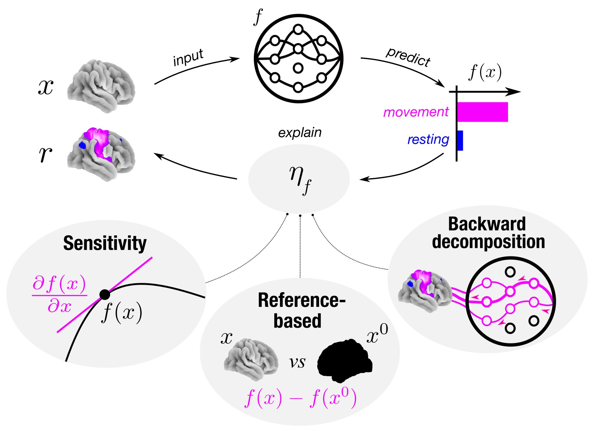

# Benchmarking explanation methods for mental state decoding with deep learning models





## Overview

This repository contains the code for: 

Thomas, A. W., Ré, C., & Poldrack, R. A. (2023). Benchmarking explanation methods for mental state decoding with deep learning models. NeuroImage, 120109. [doi.org/10.1016/j.neuroimage.2023.120109](doi.org/10.1016/j.neuroimage.2023.120109).

## Project organization

```bash
├── Makefile           <- Makefile with the following targets ('all' runs all commands in sequence):
|                        - 'hyperopt': runs 3D-CNN hyper-parameter optimization for each dataset  
|                        - 'train': trains best-performing model configurations and creates Figure 1
|                        - 'glm_bold': computes subject- and group-level GLM maps for BOLD data
|                        - 'interpret': interprets decoding decisions of trained models
|                        - 'glm_attributions': computes subject- and group-level GLM maps for attribution data
|                        - 'meta': runs meta-anlaysis with NeuroQuery
|                        - 'similarity':  similarity analysis for BOLD and attribution brain maps and creates Figure 3
|                        - 'faithfulness': computes faithulness analysis for attributions and creates Figure 4 
|                        - 'sanity_checks': computes sanity checks for attributions and creates Figure 5
├── poetry.lock        <- Used Python package versions
├── pyproject.toml     <- Specifics for installed dependencies
├── README.md          <- This README file
├── .gitignore         <- Specifies files that Git should ignore
|
├── data/
|    ├──task-heat-rejection   <- Trial-level GLM BOLD maps for heat-rejection dataset
|    ├──task-WM               <- Trial-level GLM BOLD maps for WM dataset
|    └──task-MOTOR            <- Trial-level GLM BOLD maps for MOTOR dataset
|
├── figures/
|
├── src/
|    ├── __init__.py          <- Initializes 'src' module
|    ├── data.py              <- Helper functions to load data
|    ├── model.py             <- Makes 3D-convolutional neural network
|    └── plotting.sh          <- Plotting of brain maps
|
└── scripts/
|    ├── brain-map-similarities.py                  <- Similarity analysis of brain maps
|    ├── faithfulness.py                            <- Faithfulness analysis
|    ├── fig_brain-map-similarities.py              <- Figure 4 of the manuscript
|    ├── fig_decoding-performance.py                <- Figure 2 of the manuscript
|    ├── fig_faithfulness.py                        <- Figure 5 of the manuscript
|    ├── fig_sanity-checks.py                       <- Figure 6 of the manuscript
|    ├── glm-attributions_group-level.py            <- Group-level attribution GLM maps
|    ├── glm-attributions_subject-level.py          <- Subject-level attribution GLM maps
|    ├── glm-BOLD_group-level.py                    <- Group-level BOLD GLM maps
|    ├── glm-BOLD_subject-level.py                  <- Subject-level BOLD GLM maps
|    ├── glm-BOLD_trial-level.py                    <- Trial-level BOLD GLM maps for WM and MOTOR datasets
|    ├── hyperopt.py                                <- 3D-CNN hyper-parameter optimization for each dataset
|    ├── identify-best-model-configurations.py      <- Identify best model configurations from hyperopt results
|    ├── interpret.py                               <- Interpretation of model decoding decisions
|    ├── meta-analysis.py                           <- Running meta-analysis with NeuroQuery
|    ├── rearrange_hcp-source_to_BIDS.py            <- Re-format HCP source data to BIDS-like format
|    ├── sanity-checks.py                           <- Sanity checks analysis
|    ├── sfig_attribution-variance.py               <- Appendix Figure 3
|    ├── sfig_brain-map-correlation-similarity.py   <- Appendix Figure 2
|    ├── sfig_randomized-labels-performance.py      <- Appendix Figure 4
|    └── train.py                                   <- Training of 3D-CNN
|
└── results/
|    ├── attributions           <- attribution data by dataset (as resulting from 'attribute.py')
|    ├── brain_map_similarity   <- results of brain-map-similarity analysis by dataset (as resulting from 'brain-map-similarities.py')
|    ├── faithfulness           <- results from faithfulness analysis by dataset (as resulting from 'faithfulness.py')
|    ├── glm                    <- subject- and group-level GLM maps by dataset (as resulting from 'glm-*.py' scripts)
|    ├── hyperopt               <- logging directory for hyper-parameter optimization by dataset (as resulting from 'hyperopt.py')
|    ├── meta_analysis          <- results of meta-analysis by dataset (as resulting from 'meta_analysis.py' script)
|    ├── regr                   <- results of statistical analysis
|    ├── models                 <- model fitting runs for each dataset (as resulting from 'train.py')
|    └── sanity_checks          <- results of sanity checks analysis by dataset (as resulting from 'sanity-checks.py') 
```

Note that the `results` directory is not included in this repostiory due to storage capacity limits.
